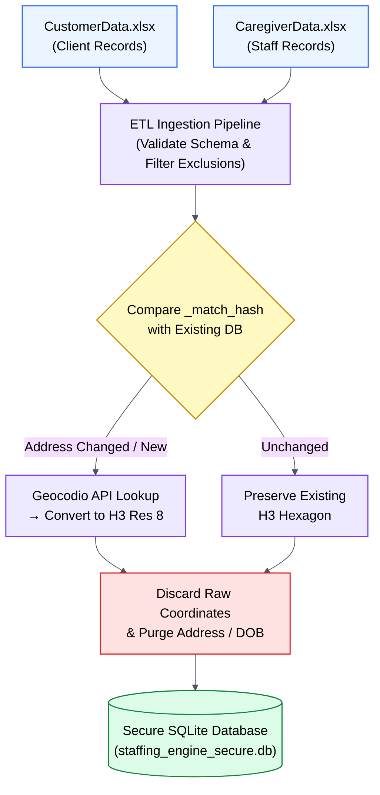

## Figure 7.1

```mermaid
%%{init: {"theme": "base", "themeVariables": {"fontFamily": "Arial, Helvetica, sans-serif", "fontSize": "18px", "primaryTextColor": "#000000", "lineColor": "#4B5563"}}}%%
flowchart TD
    CUST["CustomerData.xlsx<br/>(Client Records)"] --> PROC["ETL Ingestion Pipeline<br/>(Validate Schema & Filter Exclusions)"]
    CAREGIVER["CaregiverData.xlsx<br/>(Staff Records)"] --> PROC

    PROC --> COMP{"Compare _match_hash<br/>with Existing DB"}

    COMP -->|"Address Changed / New"| GEO["Geocodio API Lookup<br/>→ Convert to H3 Res 8"]
    COMP -->|"Unchanged"| PRESERVE["Preserve Existing<br/>H3 Hexagon"]

    GEO --> PURGE["Discard Raw Coordinates<br/>& Purge Address / DOB"]
    PRESERVE --> PURGE

    PURGE --> DB[("Secure SQLite Database<br/>(staffing_engine_secure.db)")]

    classDef input fill:#EBF5FF,stroke:#2563EB,color:#000000,stroke-width:1.5px
    classDef proc fill:#EDE9FE,stroke:#7C3AED,color:#000000,stroke-width:1.5px
    classDef check fill:#FEF9C3,stroke:#CA8A04,color:#000000,stroke-width:1.5px
    classDef purge fill:#FEE2E2,stroke:#DC2626,color:#000000,stroke-width:1.5px
    classDef db fill:#DCFCE7,stroke:#15803D,color:#000000,stroke-width:1.5px

    class CUST,CAREGIVER input
    class PROC,GEO,PRESERVE proc
    class COMP check
    class PURGE purge
    class DB db
```
