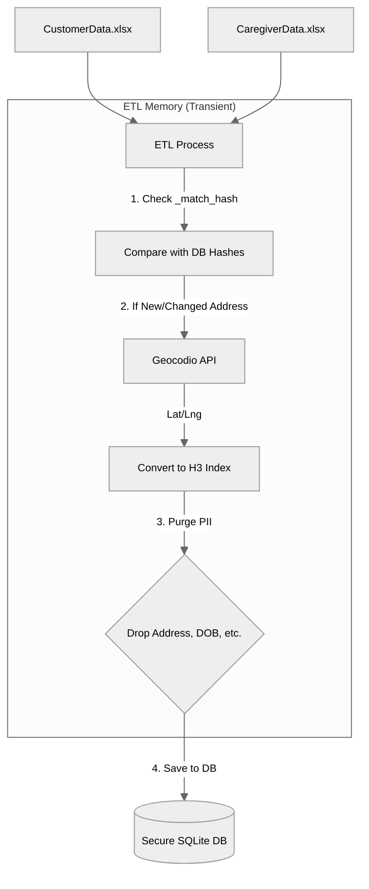

## Figure 7.1

```mermaid
%%{init: {"theme": "neutral", "themeVariables": {"fontFamily": "Arial, Helvetica, sans-serif", "fontSize": "11px", "actorFontSize": "11px", "noteFontSize": "10px", "messageFontSize": "10px"}}}%%
flowchart TD
    CUST["CustomerData.xlsx"]:::nodeStyle
    CAREGIVER["CaregiverData.xlsx"]:::nodeStyle

    subgraph ETL ["ETL Memory (Transient)"]
        ETL_PROC["ETL Process"]:::nodeStyle
        COMP["Compare with DB Hashes"]:::nodeStyle
        GEO["Geocodio API"]:::nodeStyle
        H3["Convert to H3 Index"]:::nodeStyle
        PURGE{"Drop Address, DOB, etc."}:::nodeStyle

        ETL_PROC -->|"1. Check _match_hash"| COMP
        COMP -->|"2. If New/Changed Address"| GEO
        GEO -->|"Lat/Lng"| H3
        H3 -->|"3. Purge PII"| PURGE
    end

    CUST --> ETL_PROC
    CAREGIVER --> ETL_PROC

    DB[("Secure SQLite DB")]:::dbStyle
    PURGE -->|"4. Save to DB"| DB

```
