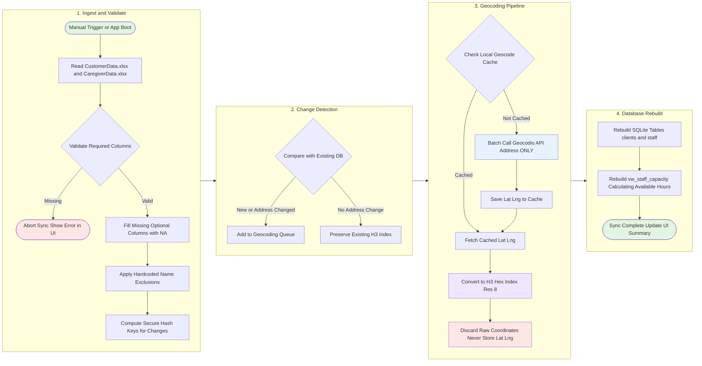
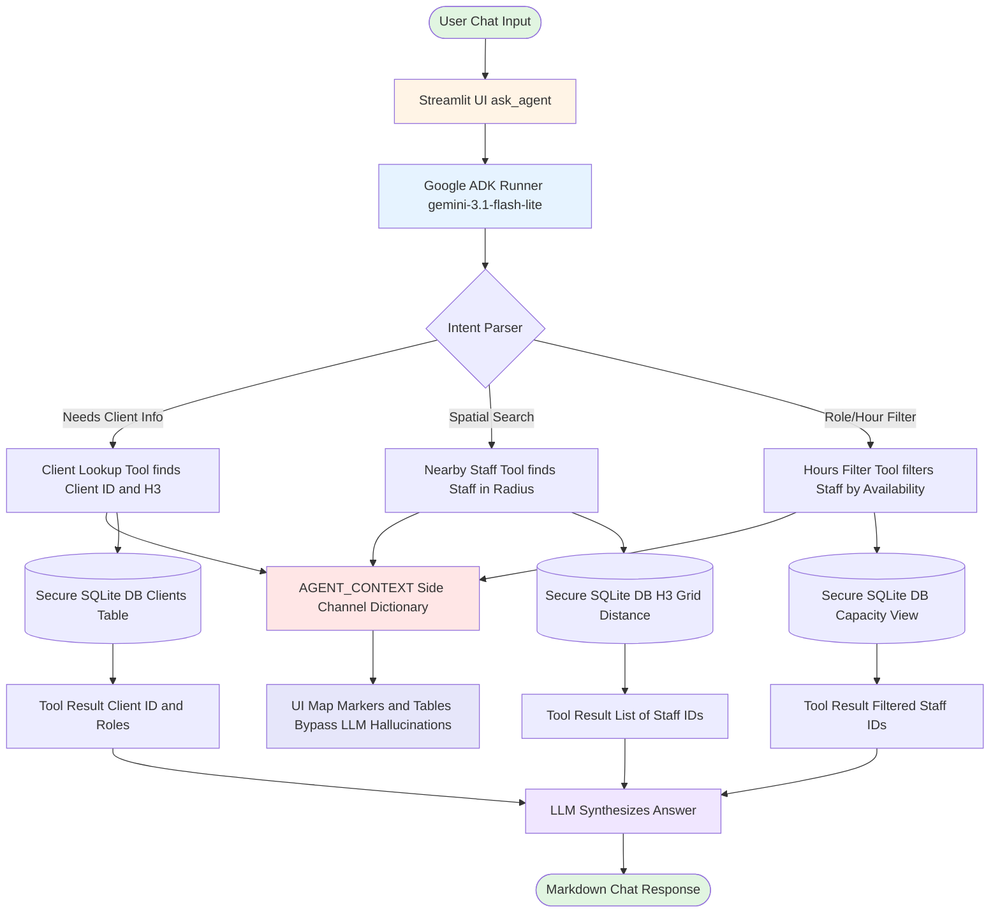
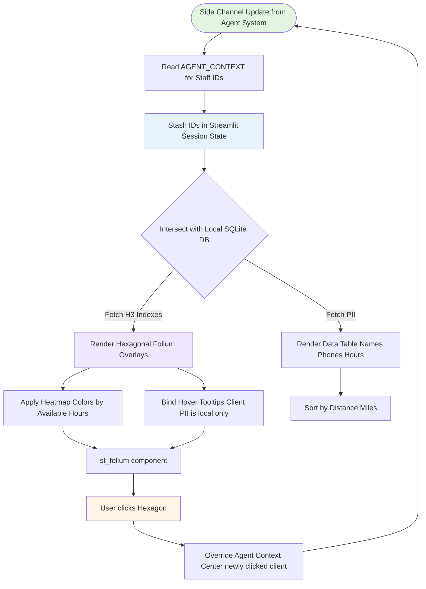
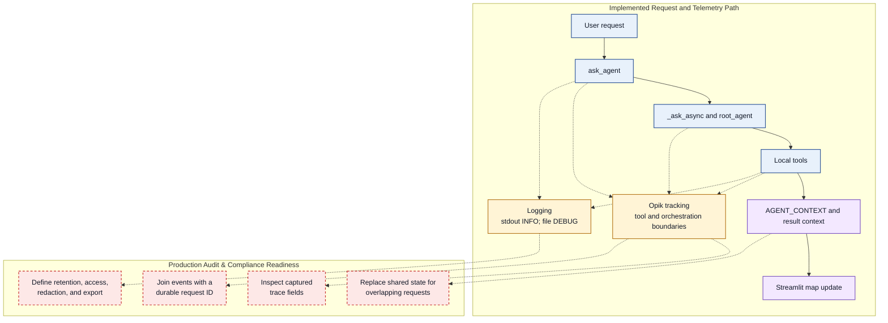

# 🏛️ Architecture & System Workflows

This document provides a comprehensive visual and technical reference for all operational workflows in the **Agentic Staffing Dashboard**. It details data synchronization, AI agent orchestration, privacy-preserving spatial visualization, and telemetry tracing.

---

## 📑 Table of Contents
1. [Data Ingestion & Privacy ETL Pipeline](#1-data-ingestion--privacy-etl-pipeline)
2. [Agent Orchestration & Deterministic Tool Routing](#2-agent-orchestration--deterministic-tool-routing)
3. [Privacy Map Rendering & Event Loop](#3-privacy-map-rendering--event-loop)
4. [Telemetry, Tracing & Audit Trail](#4-telemetry-tracing--audit-trail)

---

## 1. Data Ingestion & Privacy ETL Pipeline

The Data Synchronization Pipeline (ETL) ingests raw Excel exports from the agency management system, verifies schema integrity, geocodes addresses incrementally, and writes privacy-safe Uber H3 spatial indices to the local SQLite database.

### Key Components

1. **Data Ingestion & Validation (`etl/sync.py`)**:
   - Ingests `CustomerData.xlsx` and `CaregiverData.xlsx` via pandas.
   - Enforces required columns (`First Name`, `Last Name`, `Address 1`, `City`, `State`, `Zip`).
   - Silently drops extraneous PII columns before processing.

2. **Opaque Tracking (SHA-256 Surrogate Keys)**:
   - Rows are tracked across imports without storing raw addresses in the database.
   - Computes a deterministic surrogate key: `SHA-256(fname | lname | address_string)`.
   - Compares incoming keys against `_match_hash` in the database to detect address modifications.

3. **Incremental Geocoding & Local Cache**:
   - Queries the **Geocodio API** to convert address strings into coordinates.
   - Transmits *only* sanitized address strings over the network (no patient or caregiver names).
   - Caches coordinate results locally in SQLite to prevent duplicate API lookups.

4. **Privacy via H3 Hexagonal Grid**:
   - Converts transient latitude/longitude coordinates to **Uber H3 Resolution 8** indices (~0.73 km² cell area).
   - Raw coordinates are immediately purged from memory and are never written to the SQLite database.

5. **Capacity View Calculation**:
   - Rebuilds the `vw_staff_capacity` database view to compute available hours (`Weekly_Capacity_Hours - Scheduled_Hours`) for fast SQL filtering by agent tools.

---

## 2. Agent Orchestration & Deterministic Tool Routing

The AI Staffing Assistant bridges conversational queries from the Director of Nursing (DON) to the secured SQLite database using **Google ADK** (Agent Development Kit) with deterministic tool execution.

### Key Components

1. **In-Memory Session Runner**:
   - Preserves conversational context across chat turns using ADK's `InMemoryRunner`.
   - Isolates chat histories by `session_id`.

2. **Strict Pydantic Input Schemas**:
   - All tools enforce type validation through Pydantic schemas:
     - `ClientLookupInput`: Validates client name queries.
     - `NearbyStaffInput`: Validates radius bounds and role constraints.
     - `StaffFilterInput`: Validates role and capacity hour thresholds.

3. **H3 Spatial Traversal Rules**:
   - `find_nearby_staff` translates radial mile distances into H3 k-ring bounds (e.g., 5 miles ≈ 10 k-rings at Resolution 8).
   - Evaluates neighbor distances natively in Python via `h3.grid_distance()` without requiring spatial database extensions.

4. **Deterministic Side-Channel Map State**:
   - As Python tools execute, they write targeted spatial state (`client_id`, `radius`, `matched_staff_ids`) into a local `AGENT_CONTEXT` side-channel dictionary.
   - The UI updates its map directly from this side channel, completely preventing LLM hallucination of coordinates, distances, or names.

---

## 3. Privacy Map Rendering & Event Loop

The map visualization displays spatial proximity and staff capacity using obfuscated H3 polygons instead of pin-point GPS markers, keeping all PII rendering strictly client-side.

### Key Components

1. **The Discard Protocol**:
   - Raw latitude and longitude coordinates are never stored in SQLite. Only Resolution 8 H3 hex indices persist.

2. **Hexagonal Clustering (Folium / `st_folium`)**:
   - The map layer queries `h3.cell_to_boundary()` for each index and renders an obfuscated polygon area (~0.73 km²).
   - Provides macro-level spatial awareness for staffing coordinators while mathematically preventing street-level identification of client or caregiver homes.

3. **Visual Heatmap & Role Signatures**:
   - Caregiver hexagon fills reflect capacity depth (darker green indicating higher `Available_Hours`).
   - Distinct border color accents differentiate credentials (`PCA`, `LPN`, `RN`).

4. **Bi-Directional User Interaction Loop**:
   - Clicking a client or staff hexagon on the Folium map updates `st.session_state` and triggers `st.rerun()`.
   - The app overrides active agent context directly from local state without invoking external LLM APIs.

---

## 4. Telemetry, Tracing & Audit Trail

Observability spans user requests, ADK agent tool routing, and external API interactions, providing operational traceability while maintaining patient data isolation.

### Key Components

1. **Opik Distributed Tracing**:
   - Wraps agent entry points (`ask_agent`, `_ask_async`) and tool execution functions with `@track` decorators.
   - Captures latency, token consumption, and tool routing performance.

2. **Dual-Tier Centralized Logging (`src/logger.py`)**:
   - Structured logging powered by Loguru.
   - `stdout`: Formatted `INFO` level events for developer visibility.
   - File log: Daily rotating, compressed `DEBUG` logs in `logs/` for diagnostics.

3. **Production Audit & Compliance Verification**:
   - **Trace Field Inspection**: Ensures Opik spans only record sanitized IDs and spatial parameters, strictly excluding unmasked PHI/PII.
   - **Durable Request IDs**: Injects request-scoped UUIDs across log events and LLM spans for correlation.
   - **Log Retention & Redaction**: Automatically rolls and ages out historical local logs.
   - **Context Concurrency Isolation**: Isolates `AGENT_CONTEXT` to session memory to ensure multi-tab safety.
